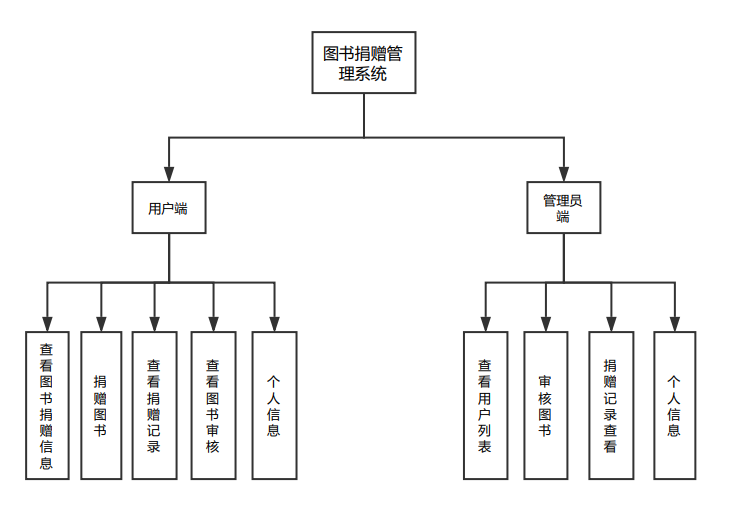
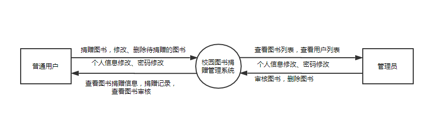
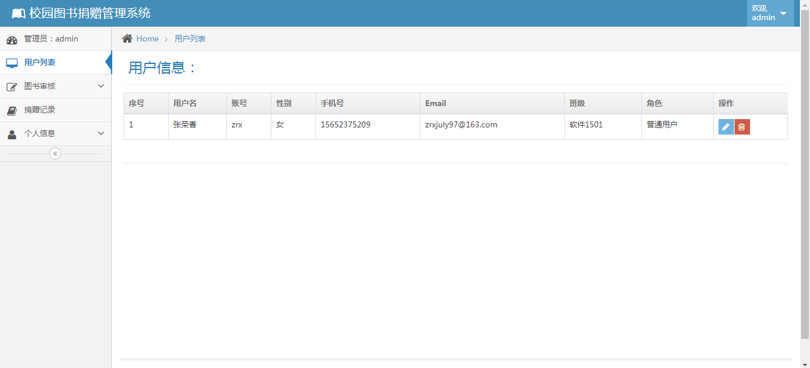
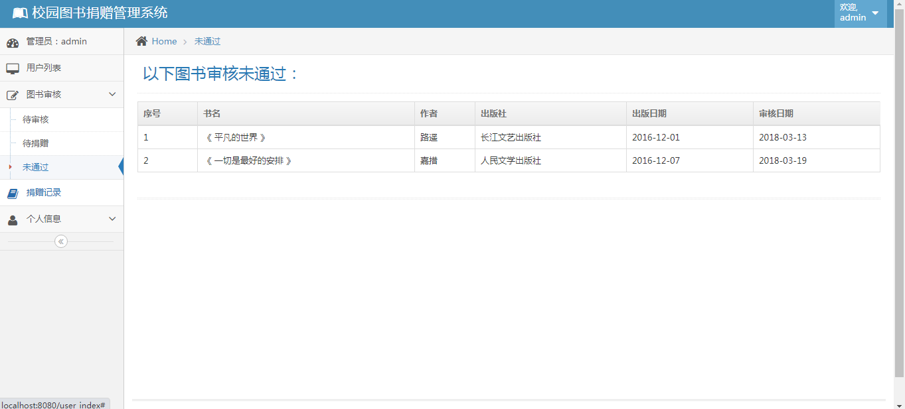
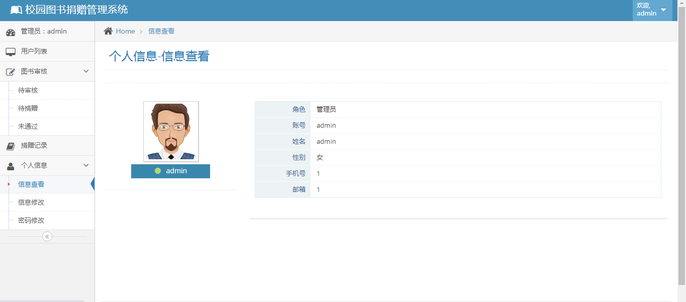

<h1 align="center">校园图书捐赠管理系统</h1>

## 简介
校园图书捐赠管理系统：角色分为管理员、用户；功能包括图书捐赠、审核管理、用户信息管理、捐赠记录追踪，旨在提升校园内图书资源的有效流通与管理。    --计算机毕业设计源码；毕设源码；java毕业设计源码

## 联系方式

<h3 align="center">获取完整代码与数据库文件 + 微信：deepguan QQ: 86050149 QQ群: 783742310</h3>

<h3 align="center">可帮忙远程部署 包运行成功！提供远程部署、修改代码、设计文档指导、代码讲解等服务！</h3>

## 功能介绍（完整见运行截图）
普通用户：普通用户可以进行图书捐赠、修改或删除待捐赠书籍，并修改个人信息和密码。用户还可以查看图书捐赠信息、个人捐赠记录以及图书审核结果，以便参与和管理自己的捐赠活动。

管理员：管理员负责管理图书捐赠的整体流程，能够查看并管理用户列表和待审核图书，进行图书的审核和删除操作。此外，管理员还可以查看捐赠记录以及修改个人信息和密码，确保系统的高效运作和图书的顺利流通。

## 运行截图

本代码来源于网络,仅供学习参考使用!

